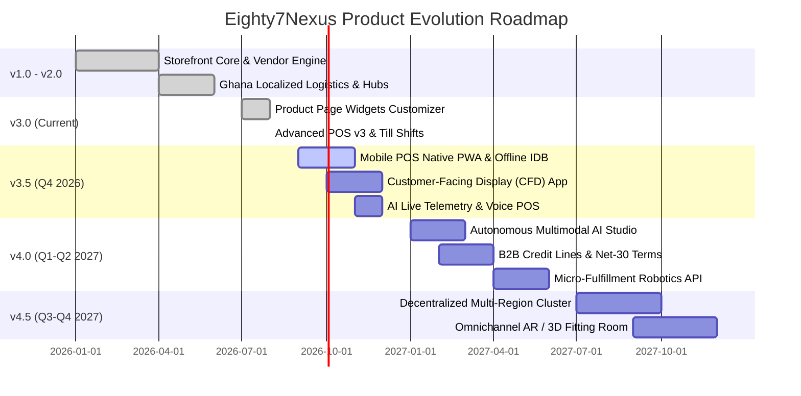

# Eighty7Nexus Platform Engineering & Product Roadmap (2026 – 2027)

> **Platform:** Eighty7Nexus Omnichannel E-Commerce & Retail Management Engine  
> **Target Version:** 3.x → 4.x Enterprise Ecosystem  
> **Architecture:** Next.js 16 (App Router) · React 19 · TypeScript · Tailwind CSS v4 · MongoDB / Mongoose · shadcn/ui · next-intl  
> **Last Updated:** August 2026  

---

## 1. Executive Vision & Strategic Pillars

**Eighty7Nexus** is engineered as a unified, high-performance, omnichannel commerce operating system bridging digital storefronts, multi-vendor marketplaces, physical retail store networks, warehouse spatial logistics, and AI-driven clienteling into a single cohesive ecosystem.

```
┌────────────────────────────────────────────────────────────────────────────────────────────────────────┐
│                                       EIGHTY7NEXUS UNIFIED ECOSYSTEM                                   │
├───────────────────────────────┬──────────────────────────────────┬─────────────────────────────────────┤
│      DIGITAL STOREFRONT       │     ENTERPRISE RETAIL POS v3     │     SUPPLY CHAIN & LOGISTICS        │
│  • Visual Header/Page Builder │  • 4 Production POS UI Themes    │  • Ghana 9-Courier Localization     │
│  • 6 Product Page Layouts     │  • Till Shifts & X/Z Reports     │  • Spatial Warehouse Bin Mapping    │
│  • 14 Dynamic Widget Docks    │  • Cross-Branch Stock Federation │  • Inter-Branch Transfers (IBT)     │
│  • Multilingual & Multi-Curr  │  • Raw ESC/POS & Scale Drivers   │  • BOPIS & QR Barcode Returns       │
├───────────────────────────────┼──────────────────────────────────┼─────────────────────────────────────┤
│      VENDOR MARKETPLACE       │        WHOLESALE B2B ENGINE      │       AUTONOMOUS AI COMMERCE        │
│  • Tiered Vendor Plans        │  • Tiered Volume Matrix Ladder   │  • AI Sales Agent Chatbot           │
│  • Boost Ads Auction Ladder   │  • Milestone Invoicing & Quotes  │  • Multimodal AI Product Studio     │
│  • Document KYC Verification  │  • Multi-Branch Inventory Alloc  │  • Automated Predictive Restocking  │
└───────────────────────────────┴──────────────────────────────────┴─────────────────────────────────────┘
```

---

## 2. Release Milestones & Chronological Trajectory



---

## 3. Platform Modules & Implementation Roadmap

### 🛒 3.1 Storefront & Content Experience Engine

| Feature / Initiative | Target Milestone | Status | Description & Deliverables |
| :--- | :---: | :---: | :--- |
| **Visual Header & Footer Builder** | v3.0 | ✅ Shipped | Drag-and-drop navigation builder, brand carousels, custom preset colors, market switchers. |
| **6 Product Page Layout Presets** | v3.0 | ✅ Shipped | Default, DigiMart High-Conversion, TechZone Split Specs, Luxury Runway, 3D Showcase, B2B Matrix. |
| **14 Product Page Widget Visibility Docks** | v3.0 | ✅ Shipped | Breadcrumbs, stock pulse, vendor card, trust badges, payment icons, delivery ETA, WhatsApp inquiry, tech specs, reviews, wholesale tier table. |
| **Interactive 3D / AR Model Viewer** | v3.5 (Q4 2026) | 🔄 In Progress | WebGL / Three.js 3D model inspector with USDZ / GLTF QuickLook for iOS and Android devices. |
| **Omnichannel Story Commerce & Shoppable Reels** | v4.0 (Q1 2027) | 📅 Planned | Short-form video feeds with 1-click cart insertion and synchronized live stock scarcity badges. |
| **Real-time Personalization & Smart Bundles** | v4.0 (Q2 2027) | 📅 Planned | Collaborative filtering recommendation engine dynamically optimizing cross-sells on checkout. |

---

### 🏪 3.2 Advanced Point of Sale (POS v3 & v4)

| Feature / Initiative | Target Milestone | Status | Description & Deliverables |
| :--- | :---: | :---: | :--- |
| **Till, Shift & Cash Drawer Engine** | v3.0 | ✅ Shipped | Opening floats, denomination counters, Paid In/Out cash drops, blind cash count, X/Z reports. |
| **4 High-Aesthetic POS UI Themes** | v3.0 | ✅ Shipped | `pos-aurora-glass`, `pos-cyber-grid`, `pos-retail-express`, `pos-boutique-luxury`. |
| **Spatial Inventory Mapping (Aisle / Bin)** | v3.0 | ✅ Shipped | `Zone → Aisle → Rack → Row → Shelf → Bin` coordinate display and inventory capacity tracker. |
| **Cross-Branch Stock Matrix & IBT** | v3.0 | ✅ Shipped | Real-time cross-store lookup matrix with 1-click Inter-Branch Transfer request creation at terminal. |
| **Hardware Driver Suite (Raw ESC/POS & Scale)** | v3.0 | ✅ Shipped | Raw binary thermal printing, RJ11 drawer pulse (`ESC p 0 25 250`), Web Serial scale driver. |
| **Customer-Facing Display (CFD) App** | v3.5 (Q4 2026) | 🔄 In Progress | Standalone secondary monitor app (`/pos/customer-display`) with BroadcastChannel / SSE streaming. |
| **Offline-First IndexedDB Engine with Dexie.js** | v3.5 (Q4 2026) | 🔄 In Progress | Local product/barcode database caching with background sync queue and zero-latency offline sales. |
| **Voice-Activated POS & Fast Barcode AI** | v4.0 (Q1 2027) | 📅 Planned | Speech-to-action cashier assistance ("Ring up 3 MacBook Pros with 10% manager discount"). |

---

### 🚚 3.3 Omnichannel Logistics & Fulfillment

| Feature / Initiative | Target Milestone | Status | Description & Deliverables |
| :--- | :---: | :---: | :--- |
| **Carrier Automation Hub** | v3.0 | ✅ Shipped | Shippo and Shiprocket integration with automated label buying and tracking sync webhooks. |
| **BOPIS (Buy Online, Pick Up In Store) Hub** | v3.5 (Q4 2026) | 🔄 In Progress | Dedicated click-and-collect fulfillment queue with digital signature capture and barcode pickup. |
| **Smart Routing & Split-Fulfillment Engine** | v4.0 (Q1 2027) | 📅 Planned | Multi-warehouse order splitting algorithm allocating line items to the nearest store to minimize ETA. |
| **Real-Time GPS Courier Telemetry** | v4.5 (Q3 2027) | 📅 Planned | Live rider tracking map on order tracking page via WebSocket telemetry. |

---

### 💼 3.4 Wholesale B2B & Multi-Store Operations

| Feature / Initiative | Target Milestone | Status | Description & Deliverables |
| :--- | :---: | :---: | :--- |
| **Wholesale Tier Pricing Ladder** | v3.0 | ✅ Shipped | Multi-tier volume discount matrix (`10-49 units: 10% off`, `50-99 units: 20% off`, `100+: 30% off`). |
| **Wholesale RFQ & Quote Builder** | v3.0 | ✅ Shipped | Custom enterprise quote requests with pricing negotiation, tax exemption certificates, and PDF export. |
| **B2B Credit Limits & Net-30 Payment Terms** | v4.0 (Q1 2027) | 📅 Planned | Credit ledger accounting, overdue invoice interest calculation, and automated dunning notices. |
| **Bulk CSV / EDI Quick Order Upload** | v4.0 (Q2 2027) | 📅 Planned | Rapid ordering via SKU + Quantity spreadsheet ingestion or EDI 850/855 purchase order pipeline. |

---

### 🤖 3.5 Autonomous AI & Clienteling Studio

| Feature / Initiative | Target Milestone | Status | Description & Deliverables |
| :--- | :---: | :---: | :--- |
| **AI Sales Agent Storefront Widget** | v3.0 | ✅ Shipped | Context-aware sales chat agent recommending products based on customer preferences. |
| **Vendor AI Product Studio** | v3.0 | ✅ Shipped | Generative product descriptions, SEO meta tag generator, and social media marketing exports. |
| **Multimodal Vision Product Onboarding** | v3.5 (Q4 2026) | 🔄 In Progress | Upload raw product photo → AI extracts title, category, specs, dimensions, and auto-removes background. |
| **Predictive Restocking & Demand Forecaster** | v4.0 (Q2 2027) | 📅 Planned | Machine learning stock depletion model warning merchants before seasonal inventory run-outs. |

---

### 🛡️ 3.6 Security, Performance & Infrastructure Horizons

| Feature / Initiative | Target Milestone | Status | Description & Deliverables |
| :--- | :---: | :---: | :--- |
| **Zero-Trust RBAC & Supervisor Overrides** | v3.0 | ✅ Shipped | 4-digit PIN verification, role elevation, manager discount limits, immutable audit trail. |
| **Full Next.js 16 SSR / ISR Optimization** | v3.0 | ✅ Shipped | Tag-based cache invalidation, parallel streaming shells, sub-second product hydration. |
| **Multi-Region MongoDB Sharding & Geo-Replication** | v4.0 (Q2 2027) | 📅 Planned | Low-latency read replicas across EMEA, Americas, and APAC nodes. |
| **Enterprise SOC 2 & ISO 27001 Compliance Pack** | v4.5 (Q4 2027) | 📅 Planned | Automated compliance scanning, immutable write-once audit logs, and hardware HSM encryption. |

---

## 4. Key Performance Indicators & Target Metrics

```
┌──────────────────────────────────────┬──────────────────────────────────────┬──────────────────────────────────────┐
│        PERFORMANCE TARGETS           │         SCALE & CONCURRENCY          │        RELIABILITY & UPTIME          │
├──────────────────────────────────────┼──────────────────────────────────────┼──────────────────────────────────────┤
│  • P95 Page Load Time: < 350ms       │  • Peak Transactions: 10,000 req/sec │  • Production SLA: 99.99% Availability│
│  • POS Barcode Scan: < 45ms          │  • Supported SKUs: 1,000,000+ Active │  • Zero Duplicate Offline Sync (100%)│
│  • Till Shift Reconciliation: < 30s  │  • Multi-Store Terminals: 5,000+     │  • Database Query Latency: < 12ms    │
└──────────────────────────────────────┴──────────────────────────────────────┴──────────────────────────────────────┘
```

---

## 5. Architectural Principles

1. **Strict Tech Stack Discipline**: Never introduce unapproved libraries; strictly leverage Next.js 16, React 19, TypeScript, MongoDB/Mongoose, Tailwind CSS v4, and shadcn/ui.
2. **Offline Resilience First**: POS and checkout pathways must never break during network drops; state persists locally and syncs idempotently.
3. **Rich Visual Aesthetics**: Every customer, vendor, cashier, and administrator touchpoint must feel polished, modern, and high-performance.
4. **Comprehensive Auditability**: Every monetary transaction, till movement, stock transfer, discount override, and configuration update is permanently indexed in the audit ledger.

---

*This roadmap serves as the official product architecture guide for Eighty7Nexus engineering and product leadership.*
