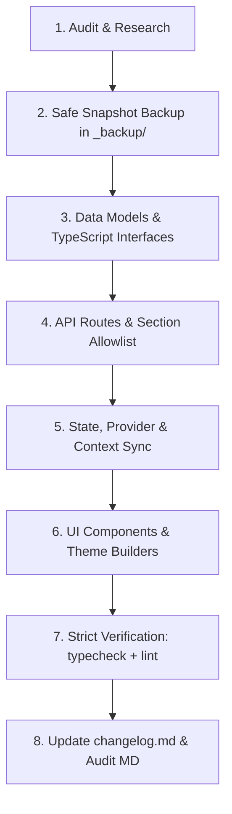

# Eighty7Nexus — Engineering Walkthrough & Replication Blueprint

This walkthrough serves as the definitive standard operating procedure (SOP) and implementation guide for future AI agents and developers building, refactoring, extending, or maintaining **Eighty7Nexus**.

---

## 🏗️ 1. Core Architecture & Tech Stack Rules

When extending or modifying the codebase, adhere strictly to the following stack standards:

| Layer | Technology | Key Constraints & Rules |
|---|---|---|
| **Framework** | **Next.js 16 (App Router)** | Use Server Components by default; add `"use client"` only when managing interactive state or client hooks. Never place manual `<head>` elements in root layout. |
| **UI Library** | **React 19** | Strict Hook ordering: invoke all hooks (`useTranslations`, `useCurrency`, `useCart`, `useWishlist`, `useParams`) at the top of the component before any early returns. |
| **Type Safety** | **TypeScript 5.x** | Strict mode enabled (`0 errors` policy). Always update `types/index.ts` alongside models. |
| **Database / ORM** | **MongoDB / Mongoose** | Always define schema fields in `models/settings.model.ts` or domain models before accessing them. Mongoose strict schema strips unmapped fields silently on `.save()`. |
| **Styling** | **Tailwind CSS (v4 semantic tokens)** | Use semantic CSS tokens (`bg-card`, `border-border`, `text-primary`, `--primary`). Avoid hardcoded color hexes or excessive AI gradient spam. |
| **Internationalization** | **Next-Intl (21 Locales)** | When adding UI labels or translation keys, populate `locales/en.json` and sync across all 20 other locale dictionaries to eliminate SSR build warnings. |
| **Package Manager** | **pnpm@10.24.0 (Corepack)** | Run lifecycle scripts via `pnpm <command>`. |

---

## 🔄 2. The 8-Step Lifecycle for Every Feature & Fix

Follow this deterministic sequence on every assignment:



---

### Step 1: Pre-Flight Audit & Research
1. Check `changelog.md` and existing docs (`ADVANCED_POS_IMPLEMENTATION_PLAN.md`, `ROADMAP.md`, `WHOLESALE_MODE_IMPLEMENTATION_PLAN.md`, `CHANGES_SINCE_AUG_24_FULL_AUDIT.md`).
2. Verify active models in `models/` and public APIs in `app/api/settings/public/route.ts`.
3. Check `_backup/` to understand historical versions and avoid regressing previously fixed issues.

---

### Step 2: Safe Snapshot Backups
Always backup every modified folder/file before making changes into `_backup/<YYYYMMDD_feature_name>/`:
```powershell
New-Item -ItemType Directory -Path "_backup/20260829_new_feature" -Force
Copy-Item -Path "components/themes/..." -Destination "_backup/20260829_new_feature/" -Recurse
```

---

### Step 3: Data Models & Schema Synchronization (`models/`, `types/`)
When introducing new settings or properties:
1. Update TypeScript interface in `types/index.ts` or `components/admin/settings/types.ts`.
2. Update Mongoose Schema in `models/settings.model.ts` (or domain model):
```typescript
// Example: Adding new enum or configuration block
export const SettingsSchema = new Schema<ISettings>({
  appearance: {
    adminLayout: {
      type: String,
      enum: ["classic", "aurora-glass", "executive-compact", "cyber-noir", "velvet-studio", "modular-canvas"],
      default: "classic"
    },
    // ...
  }
}, { timestamps: true });
```
> [!IMPORTANT]
> If a subdocument or nested array is modified, ensure `markModified('appearance.fieldName')` is called before saving in PUT handlers.

---

### Step 4: Admin API & Public Settings Allowlist
1. **Admin Settings API (`app/api/admin/settings/route.ts`)**:
   - Register the section key in `SECTION_ALLOWED_KEYS`.
   - Add dedicated normalizer functions (e.g., `normalizeHeaderSettings`, `normalizeFooterSettings`).
2. **Public Settings API (`app/api/settings/public/route.ts`)**:
   - Expose the newly required settings fields in the public sanitized payload so client storefronts can access them without authorization.

---

### Step 5: State Providers & Deserialization
1. **Public Settings Context (`providers/app-settings-provider.tsx`)**:
   - Add new fields to `AppSettingsContextValue` and `getPreloadedAppSettings` in `app/layout.tsx`.
2. **Storefront Settings Helper (`lib/storefront-settings.ts`)**:
   - Provide safe fallback defaults so SSR pages never crash if a setting document is uninitialized.

---

### Step 6: UI Components & Theme Builders
1. **Dynamic Theme Component Strategy**:
   - Storefront components (`components/themes/<theme_name>/`) must be 100% dynamic.
   - Query live catalog data from `/api/products` and `/api/categories/public` instead of using static mock arrays.
2. **Admin Studio / Builder Tab**:
   - Build companion customizers in `components/admin/online-store/` or `components/admin/settings/`.
   - Provide live sandbox previews (e.g. typography preview, widget launcher preview, color picker).
3. **Locale Sync**:
   - Add all new strings to `locales/en.json` under appropriate namespaces (`common`, `admin`, `checkout`, `pos`, etc.).
   - Propagate keys across all other 20 language files.

---

### Step 7: Strict Verification Protocol
Always run the validation suite to ensure zero regressions:
```powershell
pnpm typecheck   # Must exit with code 0 (0 errors)
pnpm lint        # Must exit with code 0 (0 warnings/errors)
pnpm test        # All test suites must pass
pnpm build       # (Optional / on-demand production bundle validation)
```

---

### Step 8: Update Changelog & Audit Logs
1. Add an itemized entry under `## [Unreleased]` or `## [YYYY-MM-DD]` in `changelog.md`:
   - Categorize under `### Added`, `### Fixed`, or `### Changed`.
   - Specify file paths, components, models, and backup folder references.
2. If major architectural changes were made, update the full audit log document (`CHANGES_SINCE_AUG_24_FULL_AUDIT.md`).

---

## 🧩 3. Architectural Blueprints for Common Tasks

### Blueprint A: Creating a New Storefront Theme (e.g., "Electro")
1. **Create Theme Folder**: `components/themes/<theme_name>/`
   - Header: `<theme>Header` (topbar, search bar, department menu, cart/wishlist triggers)
   - Hero: `<theme>Hero` (dynamic banner slider + spotlight cards)
   - Product Grid: `<theme>Deals` / `<theme>Showcase` (flash deals, countdown timer, progress bars)
   - Footer: `<theme>Footer` (trust pillars, newsletter, CMS link columns)
   - Barrel export: `index.ts`
2. **Register in Theme System**:
   - Add theme ID to `HeaderStyle` (`lib/header-config.ts`), `FooterStyle` (`lib/footer-config.ts`), and `ThemeSelectorCards`.
   - Wire delegation in `components/layout/store-header.tsx` and `components/layout/store-footer.tsx`.
   - Wire homepage section rendering in `app/[locale]/(store)/(home)/page.tsx`.

---

### Blueprint B: Adding New Admin Settings Section
1. **Define Schema**: Add subdocument to `models/settings.model.ts`.
2. **Register Section**: Add to `ADMIN_SETTINGS_SECTIONS` in `components/admin/settings/settings-sections.tsx`.
3. **Allow in API**: Add section identifier to `SECTION_ALLOWED_KEYS` in `app/api/admin/settings/route.ts`.
4. **Build Tab Component**: Create `components/admin/settings/sections/<section>-settings-tab.tsx` using `SectionCard`, `StickySaveFooter`, and Shadcn form controls.
5. **Create Route**: Create `app/[locale]/admin/settings/<section>/page.tsx`.

---

### Blueprint C: Implementing POS Peripheral Drivers & Real-Time Sync
1. **ESC/POS Binary Generation (`lib/pos/escpos-driver.ts`)**:
   - Standard 80mm/58mm text formatting, barcode generation, cash drawer pulse `ESC p 0 25 250`, paper cut `GS V 66 0`.
2. **Web Serial Hardware Scales (`lib/pos/weight-scale.ts`)**:
   - Connect via `navigator.serial.requestPort()` with auto-reconnect and regex tare weight parsing.
3. **Dual-Screen Customer Display (`lib/pos/customer-display-channel.ts`)**:
   - Broadcast state changes via `new BroadcastChannel("nexus_cfd_channel")` with SSE/polling fallback.

---

## 🛡️ 4. Essential Gotchas & Best Practices

> [!WARNING]
> **1. React Hook Call Rules**
> Never call hooks (`useTranslations`, `useCurrency`, `useCart`) inside loops, conditions, or after early `if (...) return null;` statements. Always place them at the very top of functional components.

> [!TIP]
> **2. Dynamic Google Fonts Loading**
> Never render `<link rel="stylesheet">` tags directly in Next.js RootLayout `<head>` manually, as this breaks Tailwind v4 CSS bundle hydration. Use `DynamicFontApplier` on the client side and CSS variables on `<html>`.

> [!IMPORTANT]
> **3. Mongoose Schema Whitelisting**
> If you add a field in a TypeScript interface but forget to add it to the Mongoose schema, MongoDB will silently strip the field during `.save()` operations without throwing an error. Always update both simultaneously.

> [!NOTE]
> **4. Zero Hardcoded Strings & Currencies**
> Always wrap display prices with `useCurrency().formatPrice(amount)` and user-facing text with `t("namespace.key")`.
